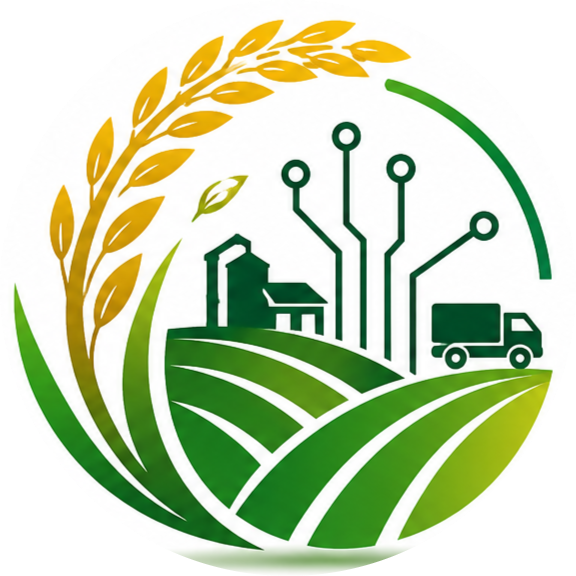

<p align="center">
  
</p>

<h1 align="center">Smart PMB</h1>

<p align="center">
  A digital platform for paddy purchasing, warehouse operations, transportation, and farmer services in Sri Lanka.<br/>
  Replaces manual, paper-based purchasing records with one connected, role-based system for farmers, drivers, warehouse managers, PMB officers, purchasers/mills, and administrators.
</p>

<p align="center">
  
  
  
  
  
  
  
</p>

<p align="center">
  <a href="#why-smart-pmb">Why Smart PMB</a> ·
  <a href="#features">Features</a> ·
  <a href="#tech-stack">Tech stack</a> ·
  <a href="#project-structure">Project structure</a> ·
  <a href="#getting-started">Getting started</a> ·
  <a href="#roles--permissions">Roles &amp; permissions</a>
</p>

---

## Why Smart PMB

Sri Lanka's paddy purchasing process still runs largely on paper: handwritten harvest records, phone-call price checks, no way to prove where a bag of paddy actually came from, and no visibility into stock levels until someone physically counts a warehouse. Smart PMB replaces that with a system every stakeholder can log into and trust.

| Problem today | What Smart PMB does about it |
| --- | --- |
| Farmers have no proof of a fair, traceable sale | Every collected harvest gets a **QR-coded lot ID** — anyone can scan it and see the verified farm → warehouse journey, no login required. |
| No way to reward reliable farmers | A **reliability score** (delivery consistency + grade history) is computed automatically and shown to both the farmer and the approving officer. |
| Farmers without smartphones miss updates | Optional **SMS alerts** for harvest status changes, on top of in-app notifications — both in **Sinhala and English**. |
| Warehouse stock is a black box until someone counts it | Warehouse managers get a **real operational portal** — live utilization, manual stock adjustments, full transaction history, and capacity alerts, scoped to only the warehouse they're appointed to. |
| The public/government has no visibility into PMB activity | A **public transparency dashboard** publishes aggregate purchase volumes and guaranteed prices — no login, no per-farmer data ever exposed. |
| Admins have no real emergency controls | A true **super-admin toolkit**: a maintenance-mode kill switch that actually locks the app, independent payments/SMS/signup kill switches, on-demand backup downloads, and audited real-user impersonation for support — with a lockout-safety-net so admin access can never be permission-configured into a dead end. |
| Officers set prices from gut feel | A lightweight **price-forecast** (trend over recent guaranteed prices) and **predictive capacity alerts** (before a warehouse actually overflows) surface on the officer's own reports. |
| Feature requests to IT go nowhere | A **token/payment-gated system-change-request workflow** — an officer requests a change, an admin sets a fee, Stripe collects payment, and progress is tracked end-to-end with notifications on both sides. |

## Features

| Portal | Highlights |
| --- | --- |
| **Farmer** | Self-registration with email confirmation, harvest submission tracking, guaranteed paddy prices, payment status, reliability score, QR-traceable collected lots, in-app + SMS notifications, full Sinhala/English UI. |
| **Driver** | Delivery tasks with accept/reject workflow, live GPS tracking on Google Maps, a personal vehicle log for fuel/maintenance records. |
| **Warehouse Manager** | A dedicated portal scoped to the single warehouse they're appointed to: live stock/utilization dashboard, manual stock add/remove with audit trail, full transaction history with search, open capacity alerts, and self-service edits to contact info/status. |
| **PMB Officer** | Its own portal separate from the admin shell: warehouse management (with add/remove-stock and manager appointment), paddy type/pricing management (plus a price-forecast card), the harvest approval workflow (pending → verified → collected/rejected, with automatic payment records and lot QR generation), fleet/route/delivery management, downloadable stock/transaction reports (PDF), and the ability to submit paid system-change requests to the admin team. |
| **Authorized Purchaser / Mill Owner** | Licensing-application self-registration, gated portal access until an officer approves the application, purchase-request workflow against warehouse stock. |
| **Admin** | User and role management with a custom RBAC (role/permission) system that can't lock itself out, a full audit/login-activity log (clustered per actor, with a per-user drill-down), a downloadable governance report (PDF), a Payments & Tokens view for the system-change-request workflow, and a super-admin toolkit: maintenance-mode kill switch, payments/SMS/signup kill switches, on-demand backup + download, and audited real-user impersonation. |

Plus, across every portal:

- **QR lot traceability** — a public, no-login page for anyone to verify a paddy lot's farm-to-warehouse journey by scanning its QR code.
- **Public transparency dashboard** — aggregate purchase volume and price trends, published outside the login wall.
- **Live activity tracking** — a real-time "who's online" widget broken down by role, with a manual refresh.
- **Portal Preview** — admins can preview any role's view of the app using safe, sample data (never real records) — distinct from real user impersonation, which is audited and notifies the impersonated account both in-app and by email.
- **Sinhala / English** — a language switcher with full translation coverage across the farmer portal and every shared settings/messaging surface.
- **Charts everywhere** — dashboards and reports are backed by real aggregation endpoints and rendered with Recharts, matching a consistent chart color palette in both light and dark themes.

## Tech stack

<table>
<tr><td valign="top">

**Backend** — `Smart_pmb_backend/pmb_bk/`
- Django 6 + Django REST Framework
- JWT authentication (`djangorestframework_simplejwt`) with httpOnly cookies
- PostgreSQL (Supabase-hosted)
- Stripe (test mode) for the system-change-request payment flow
- Text.lk for SMS delivery (OTP + optional farmer notifications)
- `qrcode` for on-the-fly lot-traceability QR codes
- ReportLab + Pillow for PDF report generation (native chart rendering, watermarking)

</td><td valign="top">

**Frontend** — `my-app/`
- Next.js 16 (App Router, Turbopack)
- React 19
- Recharts for data visualization
- Google Maps JavaScript API for live vehicle tracking
- CSS Modules with a token-based light/dark theme system
- A custom React-context i18n layer (English/Sinhala)

</td></tr>
</table>

## Project structure

```
Smart_pmb_backend/pmb_bk/    Django project
  accounts/                   Auth, users, roles, permissions, impersonation
  farmers/                    Farmers, warehouses, paddy types, harvests,
                               payments, reliability scoring, forecasting,
                               lot traceability, vehicles/routes/deliveries
  sysops/                     Audit logs, system config, maintenance-mode
                               middleware, backups, admin reports/PDF
  purchases/                  Authorized-purchaser rice requests
  mills/                      Mill-owner records
  pmb_bk/                     Project settings, URLs, ASGI/WSGI entry points

my-app/                      Next.js frontend
  app/(auth)/                  Login, signup, email confirmation
  app/(admin)/                 Admin dashboard, users, roles, warehouses,
                                pricing, approvals, transportation, reports,
                                system change requests, maintenance, settings
  app/officer/                 Dedicated PMB Officer portal
  app/farmer/                  Farmer portal
  app/driver/                  Driver portal (tasks, live tracking, vehicle log)
  app/warehouse-manager/       Warehouse Manager portal
  app/partner/                 Authorized Purchaser / Mill Owner portal
  app/trace/                   Public QR lot-traceability page
  app/transparency/            Public transparency dashboard
  app/maintenance-notice/      Public page shown during maintenance mode
  app/lib/                     Auth/JWT/session helpers, DAL (authorization gates)
  app/actions/                 Server Actions (forms, mutations)
```

## Getting started

### Backend

```bash
cd Smart_pmb_backend/pmb_bk
python -m venv venv
venv\Scripts\activate        # or `source venv/bin/activate` on macOS/Linux
pip install -r requirements.txt
```

Create a `.env` file in `Smart_pmb_backend/pmb_bk/` with your database credentials (see `.env.example` for the full list, including optional Stripe/Text.lk/Azure settings):

```env
DB_HOST=...
DB_PORT=5432
DB_NAME=postgres
DB_USER=...
DB_PASSWORD=...
```

```bash
python manage.py migrate
python manage.py runserver
```

### Frontend

```bash
cd my-app
npm install
npm run dev
```

> The frontend expects the Django backend to be running on `http://localhost:8000`.

## Roles & permissions

Access is controlled by a `Role` → `Permission` model rather than hardcoded role checks — an admin can create new roles and grant any combination of permissions at any time. The **"admin" role is this system's super admin**: a small set of the most sensitive capabilities (editing the Roles page itself, maintenance mode, kill switches, backups, impersonation) are reserved for it specifically, with a built-in safety net so an admin account can never be permission-configured into locking every admin out of `/roles`.

| Role | Typical permissions |
| --- | --- |
| **Admin** | `manage_users`, `manage_roles`, `manage_system`, `impersonate_users`, plus every other permission by default — full user/role governance and the super-admin toolkit above. |
| **PMB Officer** | `manage_warehouses`, `manage_pricing`, `record_purchases`, `monitor_operations`, `generate_reports`, `manage_transport`, `request_system_changes`, `appoint_warehouse_managers` — day-to-day purchasing, warehouse, fleet, and pricing operations. |
| **Warehouse Manager** | none — identity-scoped self-service only (their own warehouse's stock, transactions, alerts, and info). |
| **Farmer** | none — self-service only (own harvests, payments, notifications, lot QR codes). |
| **Driver** | none — self-service only (own delivery tasks, live location, vehicle log). |
| **Authorized Purchaser · Mill Owner · Moderator** | Subsets of the officer permissions above, assignable per-role. |

<sub>Full permission list: `manage_users`, `manage_roles`, `view_audit_logs`, `export_data`, `monitor_operations`, `approve_licenses`, `manage_pricing`, `manage_warehouses`, `record_purchases`, `generate_reports`, `manage_system`, `manage_transport`, `appoint_warehouse_managers`, `request_system_changes`, `manage_system_requests`, `impersonate_users`.</sub>
